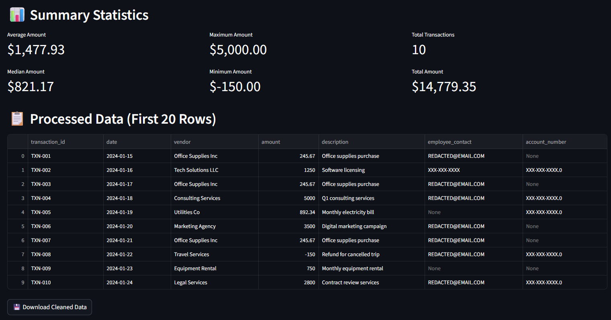

  Privacy-first AI that redacts PII, detects anomalies, and delivers instant analytics

---

## 🛡️ AccuAI – AI Accounting Assistant  
**📌 Problem**  
Accounting teams regularly handle sensitive financial data (SSNs, account numbers, employee emails) while also facing risks from duplicate payments, negative transactions, and unusual patterns that can slip through manual reviews.  

- **Privacy Risk**: Exposing personal identifiers in audit or vendor reports  
- **Compliance Risk**: Not meeting SOC2, GDPR, or HIPAA data handling requirements  
- **Financial Risk**: Fraud or payment errors leading to leakage and audit findings  

Traditional tools focus either on redaction or analysis, but not both in real time.  

---

**⚙️ Solution** 

I designed and built AccuAI, a privacy-first Streamlit application that demonstrates how AI can be applied directly to accounting workflows.  

**Key Features:**  
- 🔐 **PII Detection & Redaction** (SSNs, emails, phone numbers, account numbers)  
- ⚠️ **Anomaly Detection** (duplicate vendor payments, outliers, negative amounts)  
- 📊 **Instant Analytics** (summary statistics, visualizations, side-by-side “clean vs original” views)  
- ✅ **Usability** (simple upload → analysis → redacted file download)  

---

**📈 Results**  
- **Privacy Assurance**: Automatically removes sensitive identifiers before external use  
- **Error/Fraud Prevention**: Detects anomalies that cause financial leakage  
- **Productivity Gains**: Provides interactive analysis in seconds  
- **Audit Readiness**: Creates a clean dataset safe for external sharing  

---

**💡 Business Value**  
AccuAI demonstrates how AI can:  

- **Reduce Risk** by ensuring sensitive data never leaves the system unredacted  
- **Save Money** by catching duplicate or anomalous transactions early  
- **Boost Compliance** with privacy-first handling aligned to SOC2/GDPR expectations  
- **Improve Efficiency** by automating tedious review tasks  

---

## 📊 Process Flow  
 

  <svg viewBox="0 0 750 100" width="100%" height="auto" xmlns="http://www.w3.org/2000/svg">
    <rect x="10" y="20" width="120" height="50" fill="white" stroke="#9370DB"/>
    <text x="35" y="50" font-size="14" fill="black">Upload</text>
    <line x1="130" y1="45" x2="160" y2="45" stroke="#9370DB" marker-end="url(#arrow)"/>

    <rect x="160" y="20" width="160" height="50" fill="white" stroke="#9370DB"/>
    <text x="190" y="50" font-size="14" fill="black">Redaction</text>
    <line x1="320" y1="45" x2="350" y2="45" stroke="#9370DB" marker-end="url(#arrow)"/>

    <rect x="350" y="20" width="180" height="50" fill="white" stroke="#9370DB"/>
    <text x="370" y="50" font-size="14" fill="black">Anomalies</text>
    <line x1="530" y1="45" x2="560" y2="45" stroke="#9370DB" marker-end="url(#arrow)"/>

    <rect x="560" y="20" width="170" height="50" fill="white" stroke="#9370DB"/>
    <text x="580" y="50" font-size="14" fill="black">Analytics</text>
    <line x1="730" y1="45" x2="760" y2="45" stroke="#9370DB" marker-end="url(#arrow)"/>

    <rect x="760" y="20" width="180" height="50" fill="white" stroke="#9370DB"/>
    <text x="780" y="50" font-size="14" fill="black">Download</text>

    <defs>
      <marker id="arrow" markerWidth="10" markerHeight="10" refX="6" refY="3" orient="auto">
        <path d="M0,0 L0,6 L9,3 z" fill="#9370DB"/>
      </marker>
    </defs>
  </svg>

---

**🔗 Live Demo**  
👉 [Try AccuAI](https://ai-accounting-assistant-9sa7dkfi2llxvt8ng4shm7.streamlit.app/)  

## 🖼️ Screenshots
(Screenshots with Sample Data)

  
*Main dashboard header and key security badges.*

  
*Summary metrics including total records, anomalies detected, and PII redacted.*

 
*Summary metrics including total records, anomalies detected, and PII redacted.*

  
*Anomaly detection showing duplicate payments and unusual amounts.*

  
*Histogram and box plot visualizing transaction distribution and outliers.*

  
*Processed data with redacted PII (displaying first 10 rows).*
*Option to securely download the cleaned dataset.*

---
